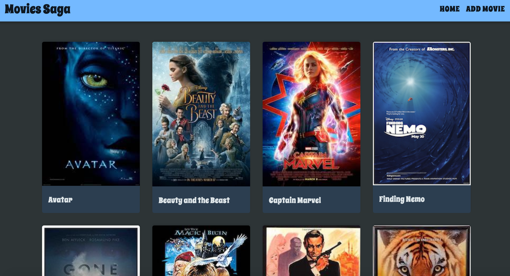
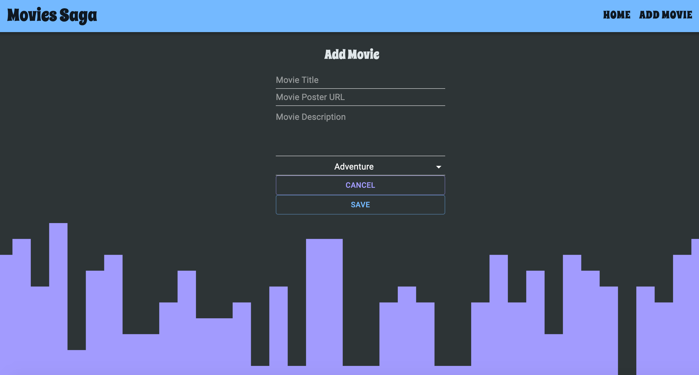

# MOVIE SAGAS

## Description

_Duration: 2 Day Sprint_

Movie Sagas is a full-stack application allowing users to view movies from a database, add new movies to the existing database, and display all the data in a user-friendly way. 

## Screen Shot

  

### Prerequisites

- [Node.js](https://nodejs.org/en/)
- [NPM](https://www.npmjs.com/)
- [Postico](https://eggerapps.at/postico/)
- [React](https://reactjs.org/)

## Installation

1. Copy and paste the `database.sql` file into Postico. The queries will set up the database and tables needed for the application to work.
2. Open up your editor and run the `npm install` command.
3. Run `npm run server` in your terminal
4. Run `npm run client` in your terminal
5. The `npm run client` command will open up a new browser tab for you!

## Usage

1. Upon the landing page loading, the user will be greeted by a variety of movies.
2. Hovering over movies, will show a description as well as categories associated with each movie.
3. In the navigation, there is an add movie form, which the user can use to add new movies into the database. Keep in mind, you will need a URL image for it to display properly on the homepage.
4. That's pretty much it! It's a stylistic view for images coming from the database, and gives you the ability to add new movies into the database.

## Built With

- [Material UI](https://material-ui.com/)
- [Node.js](https://nodejs.org/en/)
- [NPM](https://www.npmjs.com/)
- [Postico](https://eggerapps.at/postico/)
- [Postman](https://www.postman.com/)
- [React](https://reactjs.org/)
- [VS Code](https://code.visualstudio.com/)

## Acknowledgement

Thanks to [Prime Digital Academy](www.primeacademy.io) who equipped and helped me to make this application a reality.
